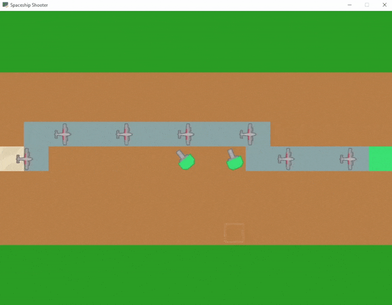

# Tower Defense Game

This is a prototype of a category of games known as *tower defense*. The purpose of this project is to learn low-level graphics libraries such as SDL2, as well as to learn various game architecture techniques and game object models. 

This project is part of a book that I'm currently reading (see below for name of the book).

## Technologies Used

Python, and SDL2 (Simple Directmedia Layer) which is a low-level 2D/3D programming library similar to OpenGL. Additionally, for the organization of classes, a technique that mixes *hierarchy game object model* and *composition game object model* is applied. This prototype also implements the A* pathfinding algorithm; the enemy follows the path while towers shoot at them.

New classes added for this project are listed below.

Components:
- Bullet
- Enemy
- Tower 
- Grid
- Tile

## Demonstration

Note: All source code for this game prototype can be found inside `.py` files.

*The book I'm currently reading for this project is called, **Game Programming in C++**.*
